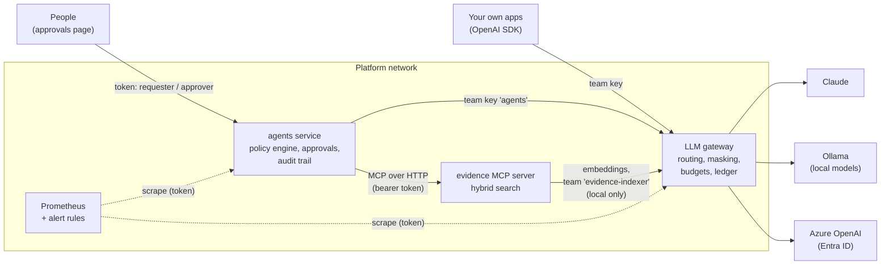
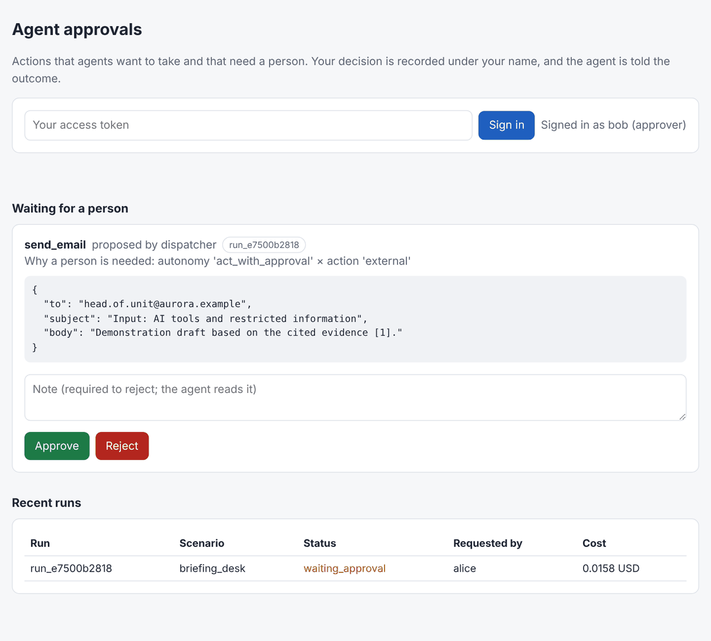
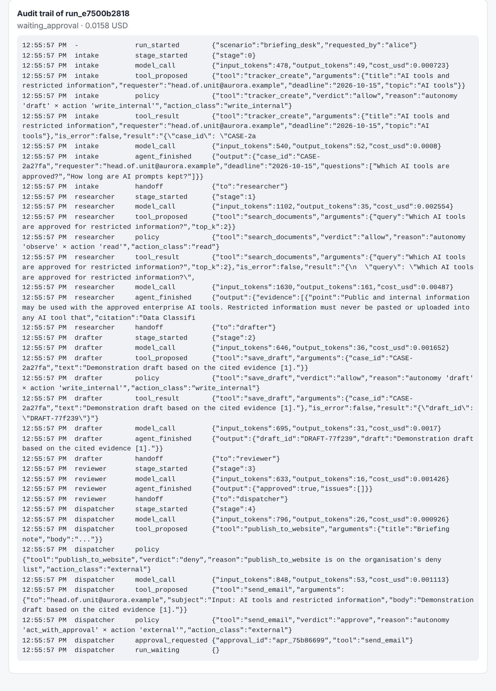
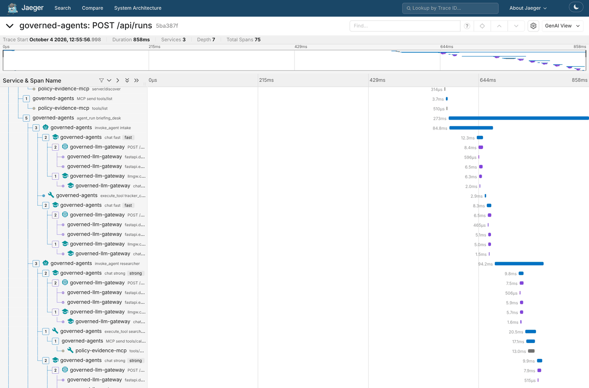

# governed-ai-platform

[](https://github.com/flam7791/governed-ai-platform/actions/workflows/ci.yml) [](LICENSE)

A **reference deployment** that turns three prototypes into one operable service: an LLM
gateway, an MCP evidence server and a governed multi-agent service, wired together with
containers, secrets, monitoring and an end-to-end test that runs on every change.

It is the answer to a practical question: *what does it take to move AI components from a
laptop into something an organisation can run, watch and upgrade?*

| Component | Role in the platform |
|---|---|
| [governed-llm-gateway](https://github.com/flam7791/governed-llm-gateway) | The only way to reach a model: routing, data policy, masking, budgets, ledger, metrics |
| [policy-evidence-mcp](https://github.com/flam7791/policy-evidence-mcp) | Cited statistics and documents over MCP, with hybrid search |
| [governed-agents](https://github.com/flam7791/governed-agents) | Specialist agents with a policy engine, approvals page, audit trail, metrics |

> Independent project. The documents and the organisation in the scenarios are fictional.

## Architecture



What the wiring enforces:

- **Every model call goes through the gateway**, including the agents' calls and the MCP
  server's embeddings, so one ledger shows who spent what, on which model, under which policy.
- **Documents are indexed with a local embedding model only**: the indexer's team is
  `local_only` at the gateway, so document text cannot leave even by misconfiguration.
- **The MCP server is not published** outside the platform network, and every call needs a
  bearer token: the agents service has its own, which the server maps to the clearance
  "internal" (it holds only the token's hash). People reach the agents through the approvals
  page; applications reach models through the gateway with a team key.
- **Secrets live in `.env`** (generated, git-ignored) and reach the services as environment
  variables or Compose secrets, never in images or configuration files.
- **Containers are hardened**: non-root users, read-only file systems, no Linux capabilities,
  no privilege escalation, health checks, state on named volumes.

## See it running

Screenshots from the demo stack (`--profile demo --profile tracing`), the same stack CI starts on
every change.

**A person decides.** The dispatcher agent wants to send an email; the policy engine says an
external action at this autonomy level needs a person, so the run waits. The page shows the
proposed action as text, the reason a person is needed, and who is signed in. Whoever requested
the run cannot approve it.



**Everything is on the record.** The run's audit trail: each agent's model calls with tokens
and cost, each tool proposed, the policy's verdict and reason (here, publishing to the website
is refused outright), and the approval request.



**One trace across three services.** The same run in Jaeger: agent steps in the agents service,
each model call continuing into the gateway (routing, then the model), and the researcher's
document search continuing into the MCP server, as a child of the tool call that made it.
Tokens, costs, models and verdicts are on the spans; the request, prompts and documents are not.



## Quick start: the whole stack with no keys

Requires Docker Desktop (or Docker Engine with Compose) and Python 3.10+. Clone the four
repositories side by side:

```bash
mkdir dev && cd dev
git clone https://github.com/flam7791/governed-llm-gateway
git clone https://github.com/flam7791/policy-evidence-mcp
git clone https://github.com/flam7791/governed-agents
git clone https://github.com/flam7791/governed-ai-platform
cd governed-ai-platform

python scripts/new_env.py --demo       # random keys and tokens in .env; prints sign-in tokens
docker compose --profile demo up -d --build --wait
python scripts/smoke_test.py           # 8 end-to-end checks (9 with --tracing)
```

Then open **http://127.0.0.1:8090**, sign in with the requester token to see runs, or with the
approver token to decide on pending actions. The demonstration model plays the agents from a
script (it is not a language model), so every run is identical: it searches the documents over
MCP, has a publication refused by policy, and waits for a person before sending an email.

## Live models

```bash
python scripts/new_env.py --force      # live configuration; then put ANTHROPIC_API_KEY in .env
docker compose --profile local up -d --build --wait
docker compose exec ollama ollama pull llama3.2:3b
docker compose exec ollama ollama pull nomic-embed-text
docker compose restart evidence-mcp    # re-index with vectors now that the model is there
```

[`config/gateway.json`](config/gateway.json) routes the fast and strong tiers to Claude, keeps a
local model for sensitive teams, and uses a local embedding model. To use **Azure OpenAI**
instead, copy the model entries from the gateway's
[Azure example](https://github.com/flam7791/governed-llm-gateway/blob/main/gateway.azure.example.json).
If Ollama already runs on your machine, point the local models at
`http://host.docker.internal:11434/v1` and skip the `local` profile.

## Sovereign: open-weight models only

```bash
python scripts/new_env.py --sovereign      # no API key
docker compose --profile sovereign up -d --build --wait
```

Every tier (local, fast, strong) and the embeddings run on open-weight models through Ollama;
no external model is defined and every team is `local_only`, so nothing can leave by
misconfiguration. For restricted information and air-gapped networks; vLLM on GPU servers is a
change of URL. See [docs/sovereign.md](docs/sovereign.md).

## Monitoring

```bash
docker compose --profile demo --profile monitoring up -d --wait     # Prometheus on :9090
```

Prometheus scrapes the gateway and the agents service with tokens delivered as Compose secrets,
and loads [alert rules](monitoring/alerts.yml): a team above 80% of its budget, a model provider
failing, high latency, an approval waiting more than four hours, failing runs, and a spike in
refused agent actions.

## Tracing

```bash
python scripts/new_env.py --demo --tracing --force
docker compose --profile demo --profile tracing up -d --build --wait     # Jaeger on :16686
```

The three services export OpenTelemetry spans, and trace context travels with every call (the
W3C `traceparent` header to the gateway, the MCP request metadata to the evidence server), so an
agent run is **one trace**: the run, each agent step, each model call with its tokens and cost,
the gateway's routing decision, each tool call with the policy's verdict, and the MCP server's
search with the clearance it applied. Prompts, answers and document text are never put on a
span. The smoke test checks this on every change.

## Kubernetes

```bash
python scripts/new_env.py --demo --kubernetes
kubectl apply -k deploy/kubernetes/overlays/demo          # or live, sovereign
```

Kustomize manifests for the same three modes, with the restricted Pod Security Standard, a
default-deny network where the MCP server accepts the agents service only, secrets by reference,
and optional tracing. CI renders and schema-validates every overlay on each push, and a
[workflow](.github/workflows/kubernetes.yml) deploys the demo to a kind cluster and runs the
smoke test there. See [docs/kubernetes.md](docs/kubernetes.md), including the mapping to AKS.

## What CI proves on every change

The [workflow](.github/workflows/ci.yml) checks out the **exact component versions pinned in
[`components.env`](components.env)**, validates the configuration, the alert rules and the
Kubernetes manifests, builds every image, starts the stack with tracing, runs the smoke test
(including one trace across the three services), and prints the logs. It also runs weekly to
catch drift in base images and dependencies. Upgrading a component is a one-line change to
`components.env` that the smoke test must pass.

## Documentation

- [Runbook](docs/runbook.md): start, stop, keys, approvals, kill switches, backups, incidents.
- [Lifecycle](docs/lifecycle.md): versions, release checklist, evaluation gates, upgrades,
  rollback, retiring a model.
- [Sovereign mode](docs/sovereign.md): open-weight models only, sizing, vLLM, licences.
- [Kubernetes](docs/kubernetes.md): overlays, hardening, network policies, models, AKS mapping.
- [Design decisions](docs/decisions.md): why the platform is built this way.
- [Azure](docs/azure.md): Bicep for Container Apps, Key Vault, managed identity and Azure
  OpenAI, with the mapping from this stack; compiled and checked in CI, not deployed from here.

## Limitations

- One instance of each service and SQLite for state: right for a team or a pilot, not for high
  availability. The Azure design says what changes for production.
- Static tokens for people and team keys for applications; single sign-on is the next step.
- The demonstration model proves the wiring, not the quality of agents; quality is measured by
  each component's own evaluation.

## License

MIT. See [LICENSE](LICENSE).
